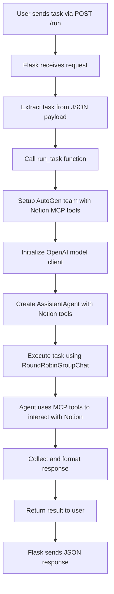

# Autogen-Flask-ngrok-Lovable-Notion-MCP-App

A Flask web application (using Lovable) that integrates with Notion using the Model Context Protocol (MCP) and AutoGen to create an AI-powered assistant for managing your Notion workspace.

## 📋 Table of Contents

- [Overview](#overview)
- [Tools and Technologies](#tools-and-technologies)
- [Application Flow](#application-flow)
- [Prerequisites](#prerequisites)
- [Installation](#installation)
- [Configuration](#configuration)
- [Usage](#usage)
- [API Endpoints](#api-endpoints)
- [Examples](#examples)
- [Frontend Integration](#frontend-integration)

## 🎯 Overview

This application creates a bridge between your Notion workspace and AI capabilities using:
- **Notion MCP Server**: Provides secure access to Notion's API
- **AutoGen**: Orchestrates AI agent interactions
- **Flask**: Serves as the web API backend
- **ngrok**: Exposes the local server to the internet for remote access

The system allows you to perform Notion operations through natural language tasks, such as creating pages, updating content, searching databases, and more.

## 🛠 Tools and Technologies

### Core Technologies

| Tool | Version | Purpose |
|------|---------|---------|
| **Python** | 3.10+ | Main programming language |
| **Flask** | Latest | Web framework for API endpoints |
| **AutoGen** | Latest | AI agent orchestration framework |
| **Notion MCP** | Latest | Model Context Protocol server for Notion |
| **OpenAI API** | GPT-4o-mini | Language model for AI agent |
| **ngrok** | Latest | Secure tunneling to localhost |

### Python Libraries

```python
# Core Dependencies
flask                 # Web framework
flask-cors           # Cross-origin resource sharing
python-dotenv        # Environment variable management
pyngrok              # Python ngrok wrapper
autogen-agentchat    # AutoGen agent chat functionality
autogen-ext          # AutoGen extensions for tools and models
asyncio              # Asynchronous programming support
```

### External Services

- **Notion API**: For workspace integration
- **OpenAI API**: For AI model access
- **ngrok**: For public URL generation

## 🔄 Application Flow



### Detailed Flow Description

1. **Request Reception**: Flask receives a POST request at `/run` endpoint
2. **Task Extraction**: JSON payload is parsed to extract the task description
3. **Team Setup**: AutoGen creates a team with:
   - MCP server connection to Notion
   - OpenAI model client (GPT-4o-mini)
   - AssistantAgent configured with Notion tools
4. **Task Execution**: The agent processes the natural language task
5. **Notion Interaction**: Agent uses MCP tools to perform operations in Notion
6. **Response Collection**: All agent messages are collected and formatted
7. **Success Validation**: Basic error checking is performed
8. **Result Return**: Formatted response is sent back to the client

## 📋 Prerequisites

Before setting up the application, ensure you have:

### Required Accounts
- **Notion Account** with API access
- **OpenAI Account** with API key
- **ngrok Account** for public URL (optional but recommended)

### System Requirements
- **Node.js** (v14+ recommended) - Required for Notion MCP server
- **Python** (3.10 or higher)
- **pip** package manager
- **Internet connection** for API calls

## 🚀 Installation

### Step 1: Clone or Create Project Directory

```bash
mkdir notion-mcp-app
cd notion-mcp-app
```

### Step 2: Set Up Python Virtual Environment

```bash
# Create virtual environment
python -m venv venv

# Activate virtual environment
# On Windows:
venv\Scripts\activate
# On macOS/Linux:
source venv/bin/activate
```

### Step 3: Install Python Dependencies

```bash
pip install flask flask-cors python-dotenv pyngrok
pip install autogen-agentchat autogen-ext
```

### Step 4: Install Node.js Dependencies

The application uses the Notion MCP server via npx, so ensure Node.js is installed:

```bash
# Verify Node.js installation
node --version
npm --version
```

## ⚙️ Configuration

### Step 1: Create Environment File

Create a `.env` file in your project root:

```env
# Notion Integration
NOTION_SECRET=your_notion_integration_secret_here

# OpenAI Configuration
OPENAI_API_KEY=your_openai_api_key_here

# ngrok Configuration (optional)
NGROK_AUTH_TOKEN=your_ngrok_auth_token_here
```

### Step 2: Obtain Required API Keys

#### Notion API Key
1. Go to [Notion Developers](https://developers.notion.com/)
2. Click "My integrations" → "New integration"
3. Name your integration and select workspace
4. Copy the "Internal Integration Token"
5. Add this token to your `.env` file as `NOTION_SECRET`

#### OpenAI API Key
1. Visit [OpenAI API Platform](https://platform.openai.com/)
2. Navigate to API Keys section
3. Create a new API key
4. Add this key to your `.env` file as `OPENAI_API_KEY`

#### ngrok Auth Token (Optional)
1. Sign up at [ngrok.com](https://ngrok.com/)
2. Go to Your Authtoken page
3. Copy the authtoken
4. Add to your `.env` file as `NGROK_AUTH_TOKEN`

### Step 3: Configure Notion Workspace

1. **Share databases/pages** with your integration:
   - Open the Notion page/database you want to access
   - Click "Share" → "Invite"
   - Search for your integration name and invite it

2. **Get Database IDs** (if needed):
   - Open the database in Notion
   - Copy the URL
   - Extract the 32-character ID from the URL

## 🎮 Usage

### Step 1: Start the Application

```bash
python final.py
```

The application will:
- Start the Flask server on port 7001
- Create an ngrok tunnel (if configured)
- Display the public URL for external access

### Step 2: Test the Health Endpoint

```bash
curl -X GET http://localhost:7001/health
```

Expected response:
```json
{
  "status": "ok",
  "message": "Notion MCP Flask App is live"
}
```

### Step 3: Execute Tasks

Send POST requests to `/run` endpoint with your tasks:

```bash
curl -X POST http://localhost:7001/run \
  -H "Content-Type: application/json" \
  -d '{
    "task": "Create a new page titled \"Hello Notion MCP\" with content \"This is a test page\" in my workspace"
  }'
```

## 📡 API Endpoints

### GET `/health`
**Purpose**: Health check endpoint
**Response**: JSON status message

### GET `/`
**Purpose**: Root endpoint with basic info
**Response**: Application status message

### POST `/run`
**Purpose**: Execute Notion tasks via AI agent
**Request Body**:
```json
{
  "task": "Your natural language task description"
}
```
**Response**:
```json
{
  "status": "success",
  "result": "Detailed execution result and agent conversation"
}
```

## 💡 Examples

### Example 1: Create a New Page

```bash
curl -X POST http://localhost:7001/run \
  -H "Content-Type: application/json" \
  -d '{
    "task": "Create a new page titled \"Meeting Notes\" with a heading \"Project Discussion\" and bullet points for agenda items"
  }'
```

### Example 2: Search Database

```bash
curl -X POST http://localhost:7001/run \
  -H "Content-Type: application/json" \
  -d '{
    "task": "Search my tasks database for all incomplete items and summarize them"
  }'
```

### Example 3: Update Page Content

```bash
curl -X POST http://localhost:7001/run \
  -H "Content-Type: application/json" \
  -d '{
    "task": "Find the page titled \"Project Status\" and add a new section about recent developments"
  }'
```

## 🎨 Frontend Integration

### Using Lovable.dev

Create a modern web interface using [Lovable.dev](https://lovable.dev/) with this prompt:

```
Create a web interface for a Notion MCP agent with the following features:

1. **Main Interface**:
   - Clean, modern design with Notion-inspired styling
   - Text area for task input with placeholder examples
   - Submit button to send tasks
   - Results display area with formatting

2. **Features**:
   - Real-time status indicators
   - Error handling and user feedback
   - Task history/recent tasks
   - Quick action buttons for common Notion operations

3. **API Integration**:
   - Send POST requests to /run endpoint
   - Handle loading states and errors
   - Format and display agent responses
   - Include retry functionality

4. **Example Tasks**:
   - Provide pre-filled example tasks users can try
   - Categories: Create Pages, Search Content, Update Data, Generate Reports

The backend API endpoint is: YOUR_NGROK_URL/run
Include proper error handling and responsive design.

## 📄 License

This project is licensed under the MIT License. See LICENSE file for details.
```
